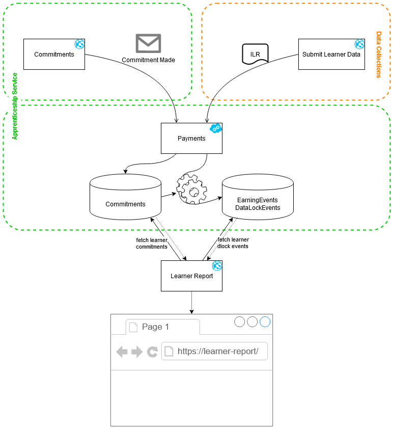
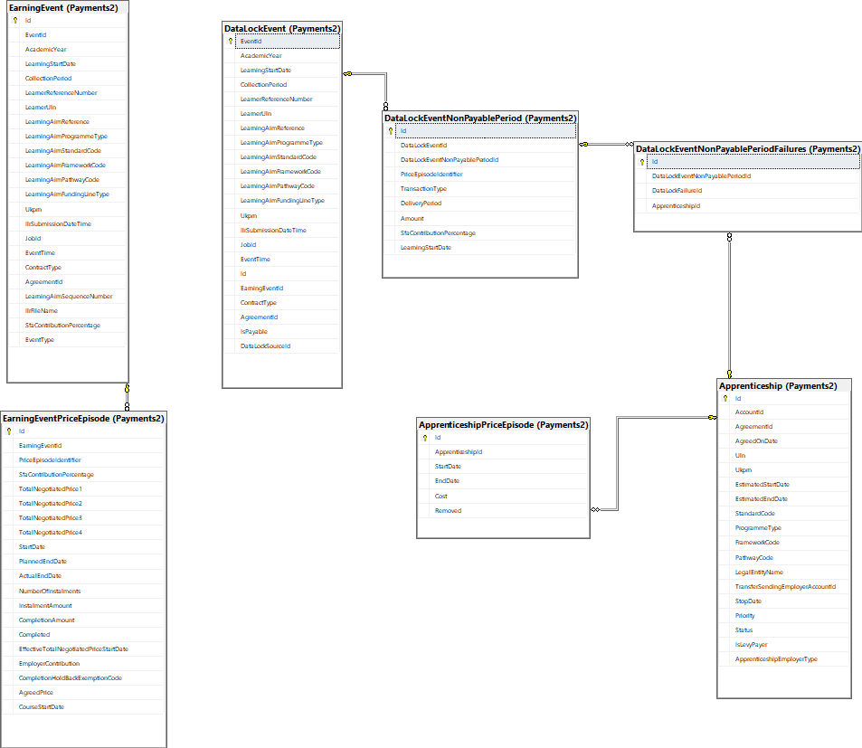

Highlight the cause of data locks for a learner.

# Development

## Design

Data regarding datalocks for each ILR submission is stored in the Payments table in the form of EarningEvents and DataLockEvents.  These are audit records of events that have been generated by the Payments system during the course of processing an ILR.  The Payments service also stores a copy of the commitments as told to it by Commitments service.

The Learner Report uses these three sets of data to determine and present data locks for a given learner.

## Performance Impact

It is critical that the report does not impose any performance loss on the main Payments operations of processing ILR earnings submissions.

The Payments database already has replication for the purposes of monitoring and metrics; the report uses this replica in order to remove any concerns about negatively impacting performance of the payment runs.

The Payments database schema is not designed to support such a report, and the number of table joins required to query the necessary data causes the report to be imperformant.  

## Database Access

The prototype directly access the Payments database tables to retrieve its data, using a copy of the Payments Entity Framework models.

To publish the database locally, use the database project in 

https://github.com/SkillsFundingAgency/das-payments-V2/blob/master/src/SFA.DAS.Payments.Database/SFA.DAS.Payments.Database.sqlproj

There should be two copies of the database - Archive and Current Period. Configure the two connection strings in `appsettings.json` in the `ESFA.DAS.IdentifyDataLocks.Web` and `SFA.DAS.IdentifyDataLocks.IntegrationTests` projects accordingly. 

(You may wish to use separate databases for the integration tests to prevent test data loss)

## Authentication and authorization
The website will use STAFF IDAMs for authentication. The authenticated users will have to belong to role `Apprenticeship Service – Data Locks`.

## Getting Started

* Clone this repo: https://github.com/SkillsFundingAgency/das-identify-data-locks
* Obtain cloud config for:
  * SFA.DAS.IdentifyDataLocks.Web_1.0
* Start Microsoft Azure Storage Emulator
* Run SFA.DAS.IdentifyDataLocks.Web

## External dependencies

### EAS API

https://test-accounts.apprenticeships.education.gov.uk/

To get the employer name and public account id, we use EAS api’s `api/accounts/internal/{accountId}` endpoint. 

`accountId` is sourced from the payments database.

### Commitments API V2

https://test-commitments-api.apprenticeships.education.gov.uk/

To get apprentice’s name, we depend on the `api/apprenticeships/?accountId` endpoint. Along with accountId, we pass the ULN in the `searchTerm` to retrieve all the apprenticeships associated to a candidate and employer. Then use one of them to get apprentice’s detail. 

`ULN` is sourced from user input.

### RoATP API

https://test-providers-api.apprenticeships.education.gov.uk/swagger/index.html

To get provider’s name, we use RoATP api’s `/api/v1/Search?SearchTerm={ukprn}` endpoint.

`UKPRN` is sourced from the payments database.
